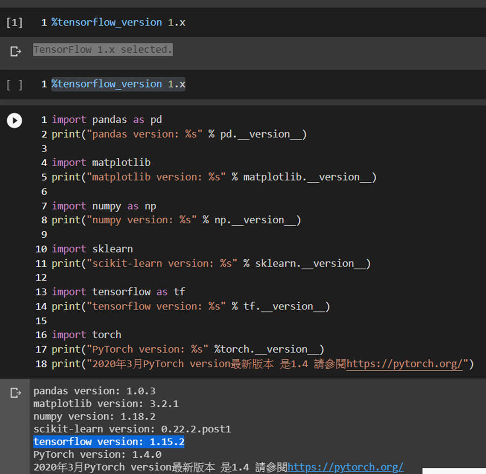

# DEEPLEARNING2020
```
官方網址: 
https://www.tensorflow.org/

教學範例:
https://www.tensorflow.org/tutorials

API說明:
TensorFlow Core v2.1.0
```
```
極詳細+超深入：最新版TensorFlow 1.x/2.x完整工程實作
作者： 李金洪  出版社：深智數位  
出版日期：2020/01/20
```
# 20200312 資料分析
```
Learning Pandas - Second Edition
https://github.com/PacktPublishing/Learning-Pandas-Second-Edition
```
```
https://github.com/MyDearGreatTeacher/uTaipei2019
```
# 20200409 Tensorflow 2.0
```
import pandas as pd
print("pandas version: %s" % pd.__version__)

import matplotlib
print("matplotlib version: %s" % matplotlib.__version__)

import numpy as np
print("numpy version: %s" % np.__version__)

import sklearn
print("scikit-learn version: %s" % sklearn.__version__)

import tensorflow as tf
print("tensorflow version: %s" % tf.__version__)

import torch
print("PyTorch version: %s" %torch.__version__)
print("2020年3月PyTorch version最新版本 是1.4 請參閱https://pytorch.org/")
```
```
20200409:
matplotlib version: 3.2.1
numpy version: 1.18.2
scikit-learn version: 0.22.2.post1
tensorflow version: 2.2.0-rc2
PyTorch version: 1.4.0
2020年3月PyTorch version最新版本 是1.4 請參閱https://pytorch.org/
```
### Google colab版本切換
```
[1]重開一個Notebook
[2]輸入並執行 
    %tensorflow_version 1.x
```


```
在colab中使用tensorflow2.1或2.0
https://blog.csdn.net/qq_42145862/article/details/104217873
```
